## 2. Preparacion de las máquinas

Para cambiar el nombre en los sevidores core usamos el comando  `Rename-Computer`.

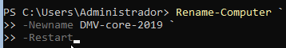

Para el servidor con entorno gráfico, en administracion del servidor hay que ir a servidor local y una vez aqui lo cambiamos haciendo clic en el nombre del equipo.
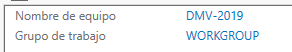

Le añdidmos una IP estatica a las maquinas usando el siguiente comando
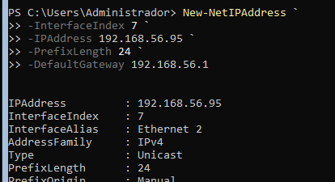
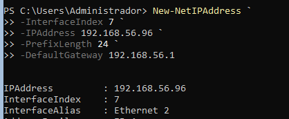

Para ayudar a la resolucion de los nombres, introduciemos la ip y el nombre en archivos hosts.
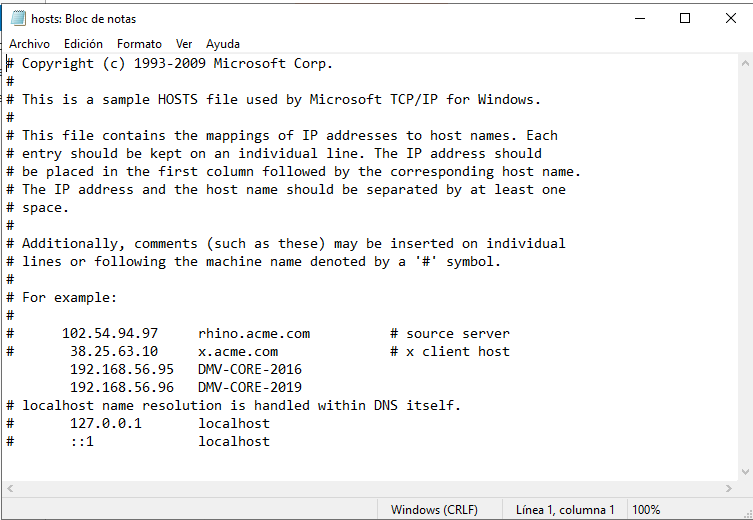

## 3. Configuracion del acceso remoto al nuevo equipo

Para deshabilitar el firewall de windows usamos el siguiente comando en los servidores core.
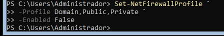

Añadimos los los servidores a la lista trustedHosts con el comando
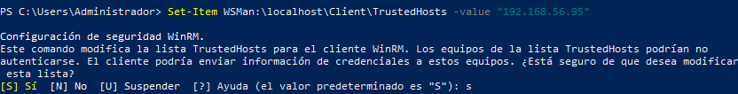

Para añidir la segunda sin sobreescribir la ip que ya teniamos se hace de la siguiente manera.
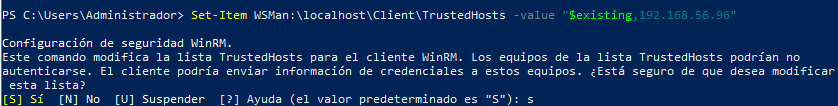

Para crear el usuario mediante powshell utilizamos los siguientes comandos.
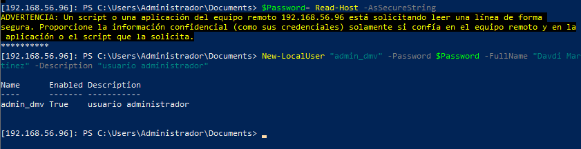

Una creado lo agregamos a al gupo Aministradores
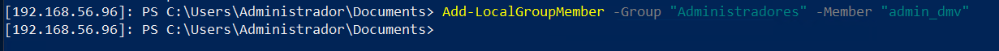

## 4. Configuración del acceso remoto sobre HTTPS

Generamos un certificado usando el siguiente comando.
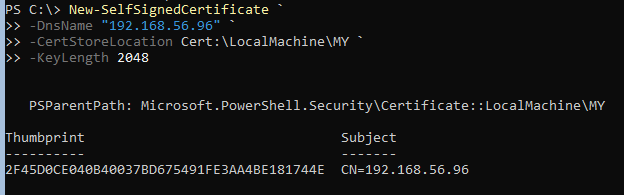

Creamos el nuevo listener HTTPS.
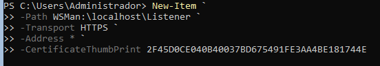

Si necesitamos borrar el listener, porque tenemos algun error podemos usar el siguiente comando.

Una vez creado comprobamos que el puerto de HTTPS esta escuchando.
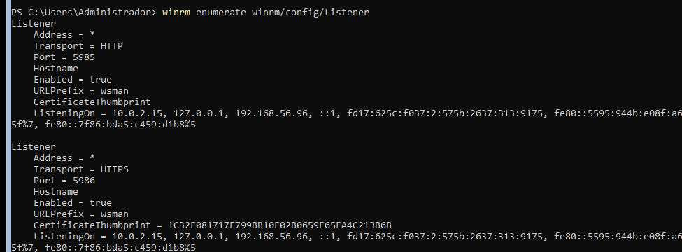

Exportamos el certificado a un fichero.
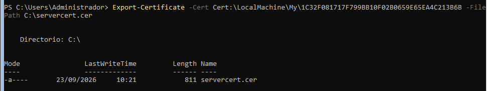

Creamos una carpeta compartida y enviamos el fichero.
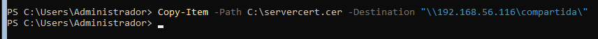

Importamos la clave.
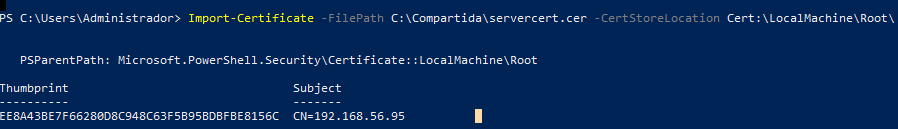

Y ya estaría.
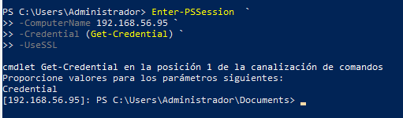

## 5. Configuracion remota con Windows admin center.

Cuando entremos la navegador para descargar el Windos Admin Center saldrá un aviso ya que el servidor tiene habilitada por defecto la Configuración de seguridad mejorada.
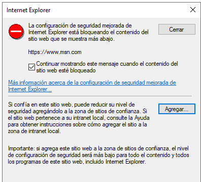

Lo desactivamos, en el Administrador del servidor.
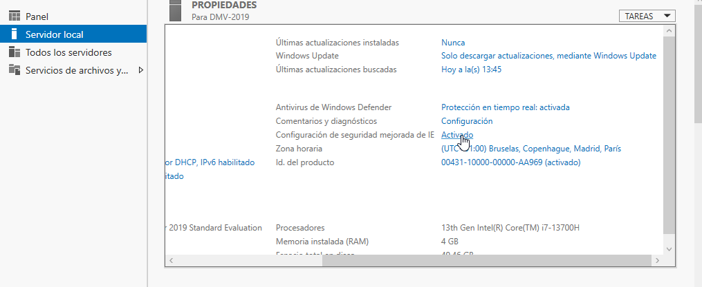

Seleccionamos desactivado y aceptamos.
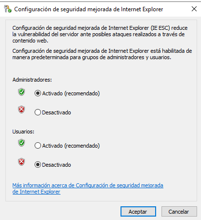

Instalamos el windows admin center.
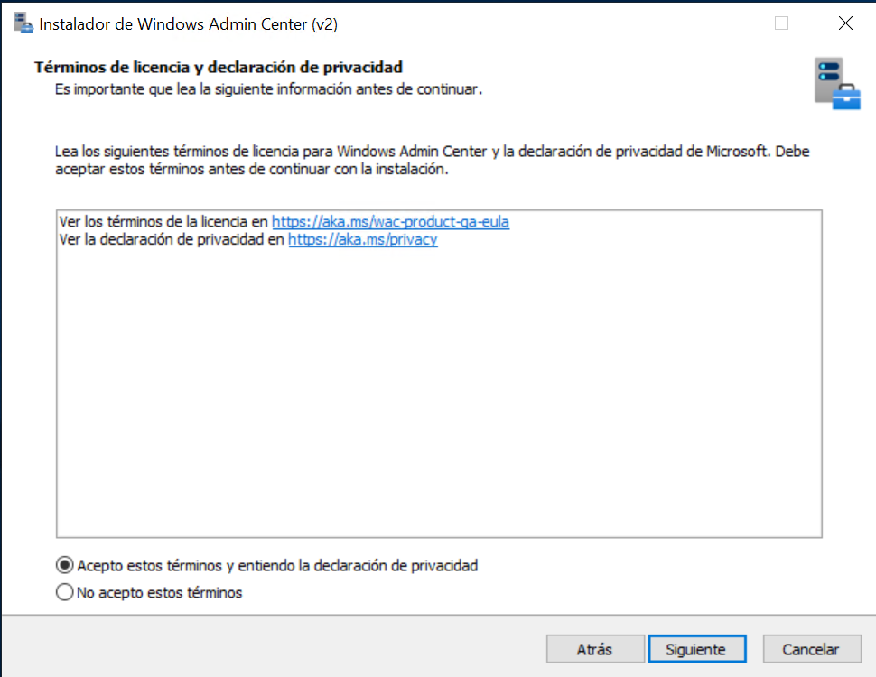

Selccionamos la configuracion rapida y clicamos en siguiente.
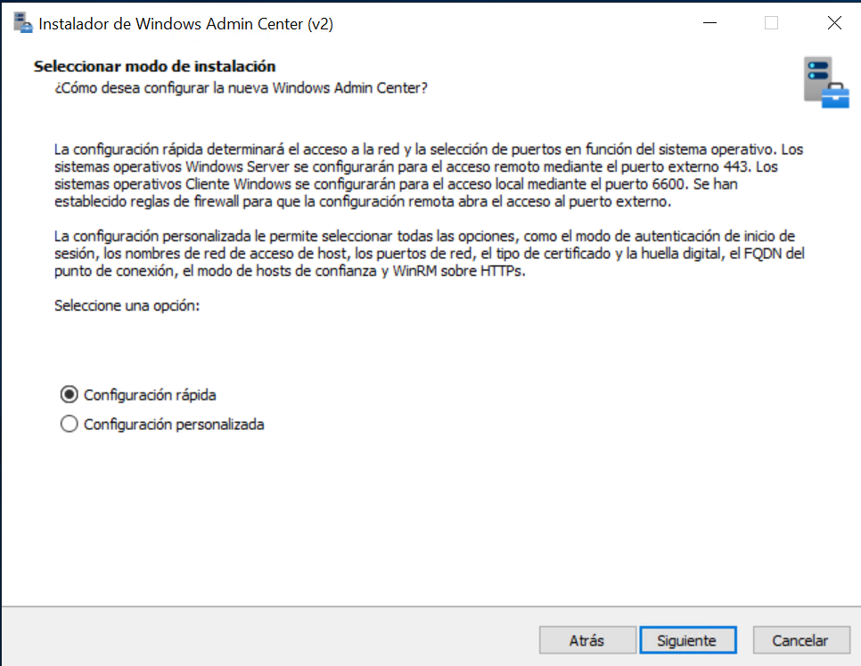

Seleccionamos la opcion de generar un certificado autofirmado.
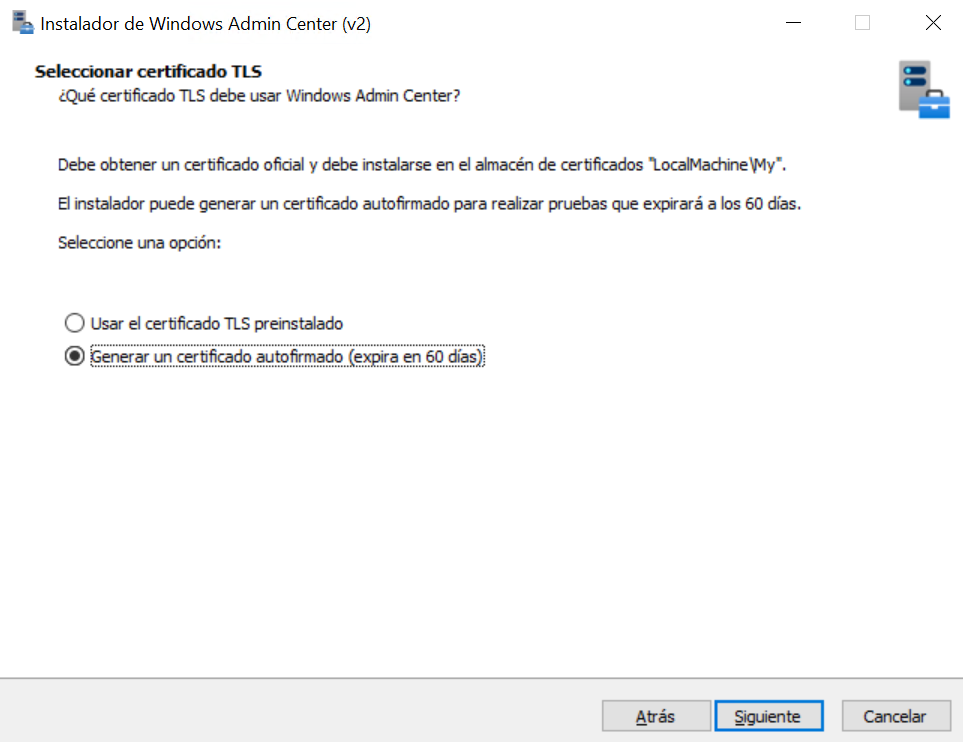

Seleccionamos la primera opción.
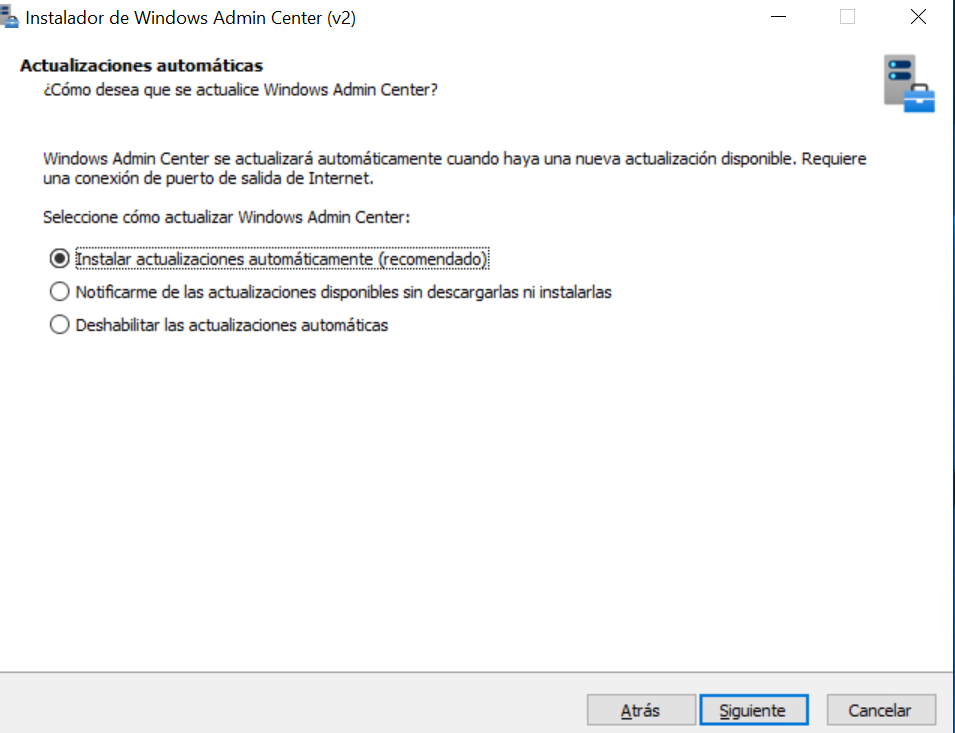

Volvemos a seleccionar la primera opción.
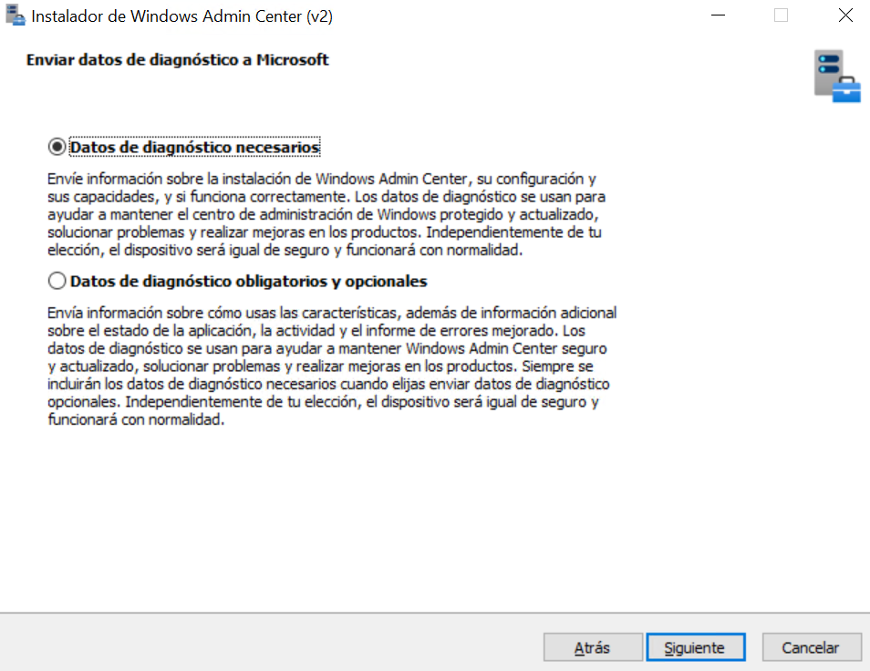

Y por ultimo, hacemos clic en instalar.
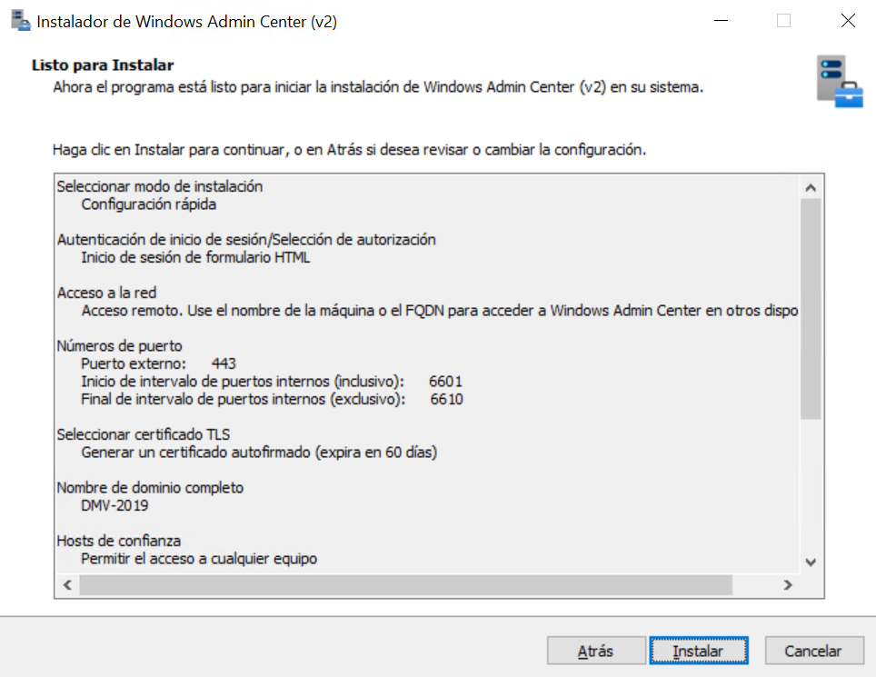

Como internet Explorer no soporta windows admin center, nos cenectaremos a al servidor a traves de nuestro ordenador.
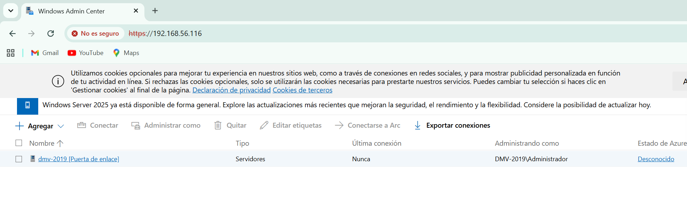

Para añadir un nuevo servior hacemos clic en agregar y agregar manualmente.
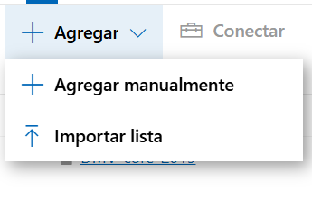

En servidores hacemos clic en agregar.
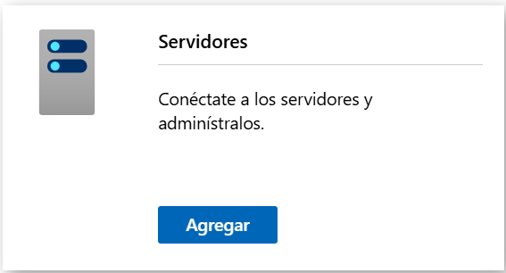

Y escribimos la IP y de nuevo hacemos clic en agregar.
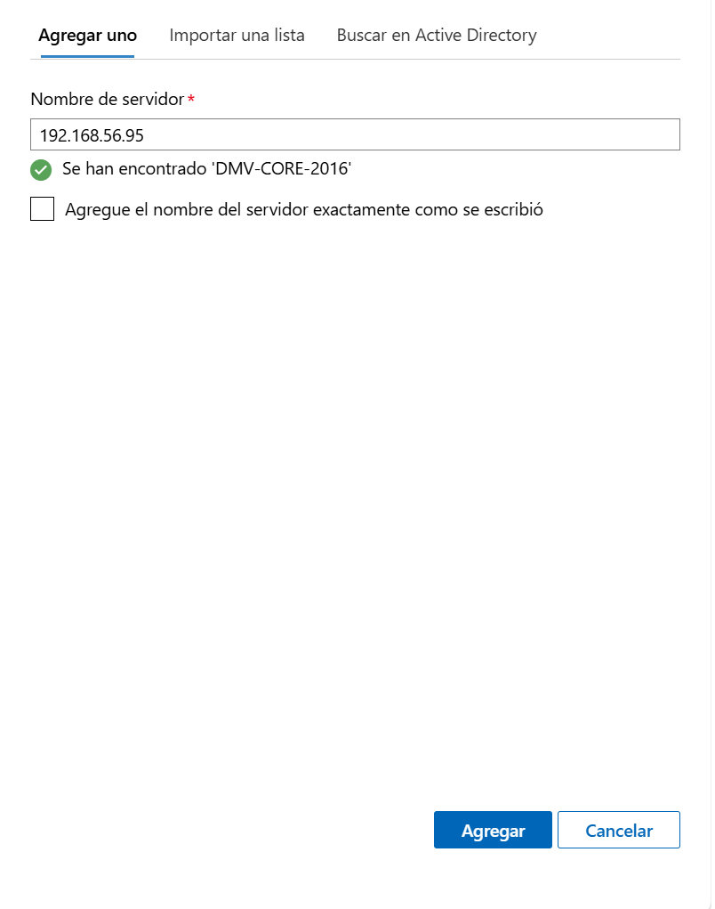

Y ya estaría.
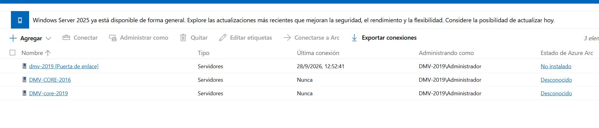

- [Volver hacia atras](../../index.md)