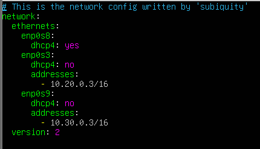
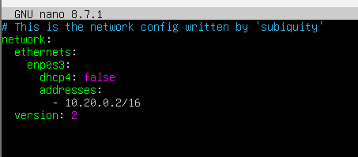
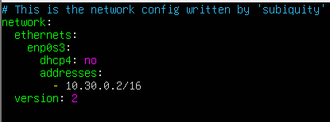

## PR0202: El protocolo SSH

Para cambiar el nombre a los equipos usamos el comando 

````
sudo hosnamectl set-hostname server-a
sudo hosnamectl set-hostname server-b
sudo hosnamectl set-hostname server-c

````

Una vez hecho esto configuramos las redes de los servidores.

Confiruación server-a


Configuración server-b


Configuracion server-c


Creamos el usuario con el nombre en el server-a y para el server-b y server-c el usuario sysadmin.
````
sudo adduser david
sudo adduser sysadmin

````

Para darle privilegios de administrador usamos el siguiente comando.

````
sudo usermod -aG sudo david

````

Ahora desde nuestro Windows, que sera el ordenardor desde el que nos conectamos generaremos un par de claves público-privada.

````

PS C:\Users\David> ssh-keygen -b 2048
Generating public/private ed25519 key pair.
Enter file in which to save the key (C:\Users\David/.ssh/id_ed25519):
C:\Users\David/.ssh/id_ed25519 already exists.
Overwrite (y/n)? y
Enter passphrase (empty for no passphrase):
Enter same passphrase again:
Your identification has been saved in C:\Users\David/.ssh/id_ed25519
Your public key has been saved in C:\Users\David/.ssh/id_ed25519.pub
The key fingerprint is:
SHA256:+GqzQELxV6HXgzCfStbsHVOk7i70oOOt67BMwRKi9/I david@DESKTOP-72N6QEO
The key's randomart image is:
+--[ED25519 256]--+
|  .   o o. .o    |
|   o   O + o     |
|. o . = B *      |
|.o o + = o +     |
|. + + o S o      |
| . = . .o.       |
|  . =  o.o.      |
|   = +=o...      |
|    E+B*...      |
+----[SHA256]-----+

````

Una vez hecho esto nos posicionamos en la carpeta .ssh y usamos el comando scp para enviar la clave publica al server-a.
````
PS C:\Users\David\.ssh> scp .\id_ed25519.pub david@192.168.56.119:id_ed25519.remote.pub

david@192.168.56.119's password:
id_ed25519.pub                                       100%  104   101.6KB/s   00:00
````

Ahora, en el server-a como en el usario david no se me ha creado el fichero authorized_keys, lo tendré que crear y dar los permisos necesarios.

````
touch authorized_keys
chmod 600 ~/.ssh/authorized_keys
````

Una vez hecho esto ya podremos enviar la clave al fichero.
````
cat id_ed25519.remote.pub > .ssh/authorized_keys
````

Y ya nos podríamos conectar.
````
PS C:\Users\David> ssh david@192.168.56.119
Welcome to Ubuntu 26.04.1 LTS (GNU/Linux 7.0.0-30-generic x86_64)

 * Documentation:  https://docs.ubuntu.com
 * Management:     https://landscape.canonical.com
 * Support:        https://ubuntu.com/pro

 System information as of mié 30 sept 2026 08:51:55 UTC

  System load: 0.0                Memory usage: 8%   Processes:       105
  Usage of /:  47.1% of 11.21GB   Swap usage:   0%   Users logged in: 0

 * Canonical Workshop gives developers fast, composable, reproducible, and
   secure developer environments that are perfect for agentic workflows.

   https://ubuntu.com/workshop

El mantenimiento de seguridad expandido para Applications está desactivado

Se pueden aplicar 0 actualizaciones de forma inmediata.

Active ESM Apps para recibir futuras actualizaciones de seguridad adicionales.
Vea https://ubuntu.com/esm o ejecute «sudo pro status»


david@server-a:~$

````

Ahora repetimos los pasos desde el server-a a los demás sevidores, como en el usuario sysdamin no se ha creado el directorio .ssh,habrá que crearlo a mano e igual con el fichero authorized_keys.

````
sysadmin@server-b:~$ mkdir .ssh
sysadmin@server-b:~$ chmod 700 .ssh
sysadmin@server-b:~/.ssh$ touch authorized_keys
sysadmin@server-b:~/.ssh$ chmod 600 authorized_keys
````

Una vez hecho esto en los dos servidores movemos la clave al fichero.
````
sysadmin@server-b:~$ cat id_ed25519.remote.pub > .ssh/authorized_keys

sysadmin@server-c:~$ cat id_ed25519.remote.pub >.ssh/authorized_keys
````

- Explica qué contienen y para qué sirven los siguientes ficheros relacionados con SSH:
  - ~/.ssh/id_rsa y ~/.ssh/id_rsa.pub: forman un par de claves SSH que sirven para conectarse de forma segura a equipos remotos si tener que escribir la contraeña.
  
  - ~/.ssh/authorized_keys: Fichero donde se almacenan las claves públicas.
  
  - ~/.ssh/known_hosts: almacena las claves publicas de los servidores a los que te conectas.
  
  - /etc/ssh/sshd_config: es el fichero de configuración de SSH.
  - /var/log/auth.log: registra todos los eventos de autenticacion, acceso y autorización de usuarios.
  
  - /etc/hosts.allow y /etc/hosts/deny: sirven para permitir o denegar el acceso a servicios en red basandose en la dirección IP.